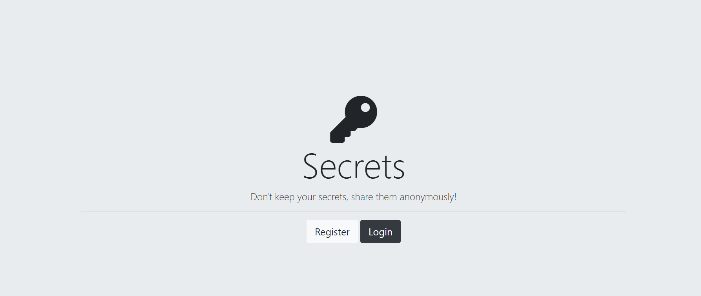
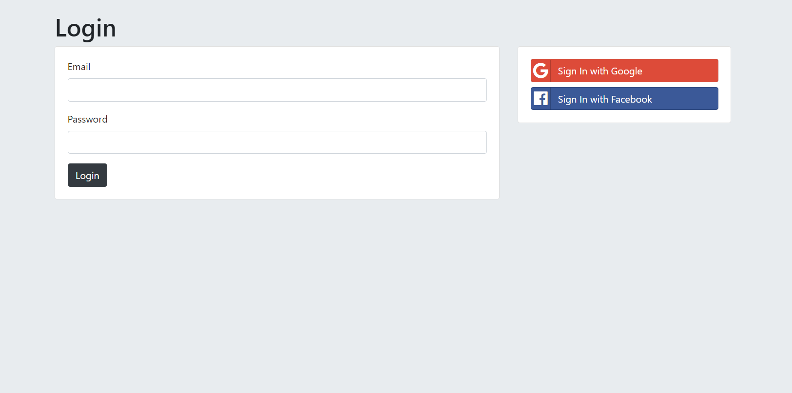
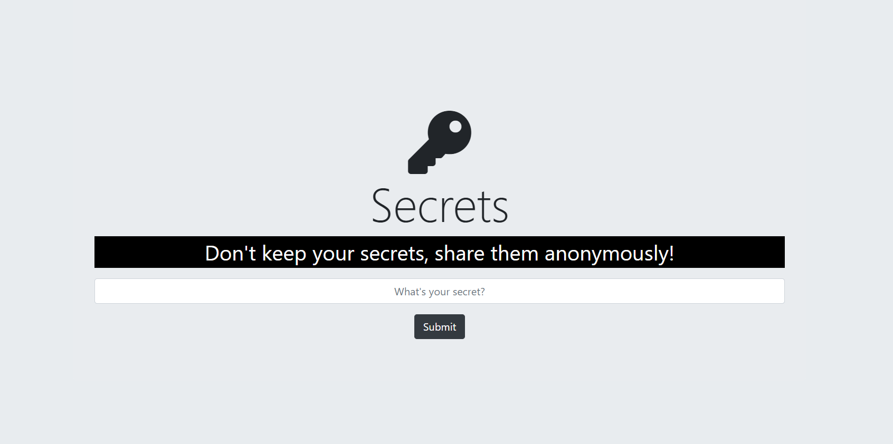

# Secrets

A web application made with node and express where users can share secrets anonymously.


## Set up

fork [this](https://github.com/YashJain2409/Secrets) repository

Clone the project

```bash
  git clone https://github.com/YashJain2409/Secrets
```

Go to the project directory

```bash
  cd my-project
```

Install dependencies

```bash
  npm install
```

Start the server

```bash
   node app.js
```


## ScreenShots
###home

###Register

###Login

###Secrets

###Add new secret

